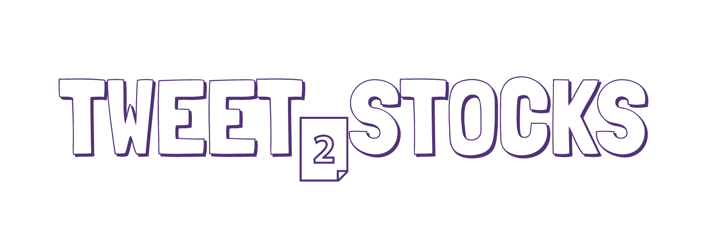

This python program that analyzes recent tweets that mentions any publicly traded companies and lunches a sentiment analysis to determine whether the aggregate opinion of the company in question is positive or negative.


---

## 🤔 Why make '_Tweet2Stocks_'?

This project was created for the [HackUIowa](https://hackuiowa-2019.devpost.com/) event. 

HackUIowa is a 2 day non-stop hackathon, and it will be held at University of Iowa in the heart of downtown Iowa City, USA. The event is open to all university students that have a passion for creating things with technology!

## Technologies

The code is written in Python and its entity detection and sentiment analysis is
done using Google's [Cloud Natural Language API](https://cloud.google.com/natural-language/) and the
[Wikidata Query Service](https://query.wikidata.org/) provides the company data.

Follow these steps to run the code yourself:

### 2. Set up auth

The authentication keys for the different APIs are read from shell environment
variables. Each service has different steps to obtain them.

#### Twitter

Log in to your [Twitter](https://twitter.com/) account and
[create a new application](https://apps.twitter.com/app/new). Under the *Keys
and Access Tokens* tab for [your app](https://apps.twitter.com/) you'll find
the *Consumer Key* and *Consumer Secret*. Export both to environment variables:

```shell
export TWITTER_CONSUMER_KEY="<YOUR_CONSUMER_KEY>"
export TWITTER_CONSUMER_SECRET="<YOUR_CONSUMER_SECRET>"
```

If you want the tweets to come from the same account that owns the application,
simply use the *Access Token* and *Access Token Secret* on the same page. If
you want to tweet from a different account, follow the
[steps to obtain an access token](https://dev.twitter.com/oauth/overview). Then
export both to environment variables:

```shell
export TWITTER_ACCESS_TOKEN="<YOUR_ACCESS_TOKEN>"
export TWITTER_ACCESS_TOKEN_SECRET="<YOUR_ACCESS_TOKEN_SECRET>"
```

### 2. Install dependencies

There are a few library dependencies, which you can install using
[pip](https://pip.pypa.io/en/stable/quickstart/):

```shell
$ pip install -r requirements.txt
```

### 3. Run the program

```shell script
python3 tweet2stocks.py
```

## License

Copyright 2017 Nicholas Adamou, Cole Horner, Angel Fabila

Licensed under the Apache License, Version 2.0 (the "License");
you may not use this file except in compliance with the License.
You may obtain a copy of the License at

    http://www.apache.org/licenses/LICENSE-2.0

Unless required by applicable law or agreed to in writing, software
distributed under the License is distributed on an "AS IS" BASIS,
WITHOUT WARRANTIES OR CONDITIONS OF ANY KIND, either express or implied.
See the License for the specific language governing permissions and
limitations under the License.
